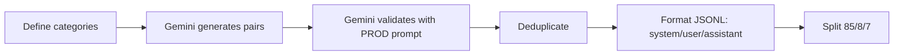
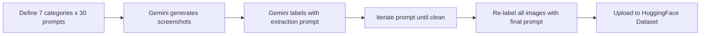

# Fine-tune Qwen3.5 on Apple Silicon

You are helping fine-tune a Qwen3.5 model on Apple Silicon. This skill encodes hard-won knowledge from real training runs — follow it to avoid hours of debugging.

## Decision: Which framework?

Ask yourself: **does the task involve images?**

- **Text only** → Use `mlx_lm`. Fast (5 min), battle-tested, simple.
- **Images (VLM)** → Use `transformers` + `peft` on MPS. Do NOT use `mlx-vlm` LoRA — it corrupts Qwen3.5 generation (outputs only vision tokens). This is a confirmed bug in mlx-vlm v0.4.0 with the DeltaRNN architecture.

## Critical gotchas

### Transformers 5.x + Qwen3.5 without PyTorch/torchvision

The video processor subsystem crashes. You MUST apply patches BEFORE any model loading:

```python
# Save as _patches.py, import before anything else
import transformers.models.auto.video_processing_auto as vpa
import transformers.processing_utils as pu

_orig_fp = vpa.AutoVideoProcessor.from_pretrained.__func__
@classmethod
def _safe_fp(cls, *args, **kwargs):
    try:
        return _orig_fp(cls, *args, **kwargs)
    except (TypeError, ValueError):
        return None
vpa.AutoVideoProcessor.from_pretrained = _safe_fp

_orig_check = pu.ProcessorMixin.check_argument_for_proper_class
def _safe_check(self, name, arg):
    if arg is None and "video" in name.lower():
        return
    return _orig_check(self, name, arg)
pu.ProcessorMixin.check_argument_for_proper_class = _safe_check
```

If running `mlx_vlm.lora` as a module, you can't apply patches normally. Create a wrapper:

```python
# train_wrapper.py
from _patches import apply_patches
apply_patches()
import runpy
runpy.run_module("mlx_vlm.lora", run_name="__main__")
```

Then: `python3 train_wrapper.py --model-path ... --dataset ...`

### MPS training constraints

When using PyTorch on Apple Silicon MPS backend:

```python
# MANDATORY settings — MPS will crash or silently corrupt without these
model = AutoModelForImageTextToText.from_pretrained(
    model_id,
    torch_dtype=torch.float32,  # NO bf16, NO fp16 on MPS
)

TrainingArguments(
    fp16=False,                   # MPS doesn't support
    bf16=False,                   # MPS doesn't support
    dataloader_pin_memory=False,  # CRASHES without this on MPS
    per_device_train_batch_size=1, # Use grad accumulation instead
    gradient_accumulation_steps=4,
)
```

### OpenRouter image generation API

Images come in `msg["images"]`, NOT in `msg["content"]`:

```python
message = result["choices"][0]["message"]

# PRIMARY: check "images" field
images = message.get("images", [])
if images:
    img = images[0]
    if isinstance(img, dict) and "image_url" in img:
        url = img["image_url"]["url"]  # "data:image/png;base64,..."
        b64 = url.split(",", 1)[1]
        return base64.b64decode(b64)

# FALLBACK: check content list
content = message.get("content", "")
if isinstance(content, list):
    for part in content:
        if part.get("type") == "image_url":
            # ... same extraction
```

Text content from labeling can also be string OR list — always handle both:

```python
text = message.get("content", "")
if isinstance(text, list):
    text = " ".join(p.get("text", "") for p in text if p.get("type") == "text")
```

### mlx-vlm LoRA: `--iters` vs dataset size

`mlx-vlm` does `dataset.select(range(iters))`. If `--iters > len(dataset)`, it crashes with `IndexError`. Set `--iters` to at most your dataset size. The `--epochs` flag computes `iters = epochs * len(dataset)` but still calls `select(range(iters))` on the un-repeated dataset — same crash.

### mlx-vlm adapter directory structure

After training, mlx-vlm saves adapters flat: `output_path.safetensors` + `adapter_config.json` in the parent directory. But `load(model, adapter_path=...)` expects a DIRECTORY containing `adapters.safetensors`. You must reorganize:

```bash
mkdir -p vlm_training/my-lora
mv vlm_training/my-lora.safetensors vlm_training/my-lora/adapters.safetensors
cp vlm_training/adapter_config.json vlm_training/my-lora/
```

### Qwen3.5 chat template for VLM

The Jinja template expects content items with `"image"` or `"image_url"` keys. For training, the conversation format must be:

```python
messages = [
    {"role": "user", "content": [
        {"type": "image", "image": pil_image},
        {"type": "text", "text": question},
    ]},
    {"role": "assistant", "content": [
        {"type": "text", "text": answer},
    ]},
]
```

Do NOT use `--custom-prompt-format` with mlx-vlm for Qwen models — it produces `{"user": [...], "assistant": [...]}` which is a dict, but the chat template expects a list of `{"role": ..., "content": ...}` messages. The built-in Qwen path handles this correctly without custom format.

### Label masking for VLM training

When training on completions only, find `<|im_start|>assistant` token sequence and mask everything before AND including the newline after it:

```python
assistant_tokens = tokenizer.encode("<|im_start|>assistant", add_special_tokens=False)
for i in range(len(labels)):
    ids = input_ids[i].tolist()
    for j in range(len(ids) - len(assistant_tokens)):
        if ids[j:j+len(assistant_tokens)] == assistant_tokens:
            labels[i, :j + len(assistant_tokens) + 1] = -100  # +1 for \n
            break
```

## Data generation workflow

### Text correction data (knowledge distillation)



Key: step C uses the EXACT system prompt from production. This eliminates train/inference distribution mismatch. The student can outperform the teacher because it learns a perfectly consistent decision boundary.

Categories that work well: filler removal, cross-sentence corrections, nested corrections, realistic long messages, edge cases (false negatives).

### VLM data (synthetic images)



Always iterate the labeling prompt on a small batch (5-8 images) before running on the full set. Check for:
- UI chrome leaking in (File, Edit, View menus)
- Hallucinated/garbled text from AI-generated images (skip these)
- Term count per category — should be 15-30, not 50-90

Use parallel workers (6-8) with ThreadPoolExecutor. Save incrementally every 5 entries. Always back up before relabeling.

## Evaluation methodology

### Term-based metrics for extraction tasks

Use fuzzy substring matching, not exact match:

```python
for predicted_term in predicted:
    for gt_term in ground_truth:
        if predicted_term in gt_term or gt_term in predicted_term:
            # Count as match
```

This handles variations like "PostgreSQL 16" matching "PostgreSQL".

### Quick eval before full benchmark

Always run on 3-5 images first to verify the adapter isn't broken:

```python
result = generate(model, processor, prompt=prompt, image=img_path, max_tokens=500)
raw = result.text if hasattr(result, "text") else str(result)
print(repr(raw[:200]))  # Check for vision token corruption
```

If output is `<|vision_start|><|image_pad|><|vision_end|>` — the adapter is broken. Do NOT run a full benchmark.

## Training recipes

### Recipe: Text correction with mlx_lm

```bash
# Generate data
python3 scripts/generate_training_data.py --count 200 --output training_data.json

# Format
python3 scripts/format_dataset.py --input training_data.json --output dataset/

# Train (~5 min)
python3 -m mlx_lm.lora \
    --model mlx-community/Qwen3.5-0.8B-8bit \
    --data dataset/ --train \
    --iters 1000 --batch-size 2 --learning-rate 3e-5 \
    --lora-rank 8 --steps-per-eval 200 \
    --adapter-path my-lora

# Fuse
python3 -m mlx_lm.fuse \
    --model mlx-community/Qwen3.5-0.8B-8bit \
    --adapter-path my-lora \
    --save-path my-fused-model

# Inference — MUST disable thinking for Qwen3.5
prompt = tokenizer.apply_chat_template(messages, tokenize=False,
    add_generation_prompt=True, enable_thinking=False)
```

### Recipe: VLM fine-tuning with PEFT

**Critical: Qwen3.5 LoRA target modules.** The model is 75% GatedDeltaNet, 25% standard attention. You must target both layer types AND exclude gate projections:

```python
target_modules=[
    # Standard attention (25% of layers)
    "q_proj", "k_proj", "v_proj", "o_proj",
    # GatedDeltaNet (75% of layers) — EXCLUDE in_proj_a, in_proj_b
    "in_proj_qkv", "in_proj_z", "out_proj",
    # MLP (all layers)
    "gate_proj", "up_proj", "down_proj",
]
```

Never include `in_proj_a` or `in_proj_b` — they control the recurrent decay/update gates through a double exponential. LoRA perturbations cause state explosion or amnesia.

```bash
# Generate images + labels (parallel, ~10 min)
python3 scripts/generate_vlm_training_data.py

# Iterate labeling prompt on small batch first!
# Then relabel all images with final prompt
python3 scripts/relabel_training_data.py

# Upload dataset to HuggingFace
python3 scripts/format_vlm_dataset.py

# Train with PEFT on MPS (~7 hours for 3 epochs)
python3 scripts/train_vlm_peft.py

# Convert back to MLX 8-bit
python3 -m mlx_vlm convert \
    --hf-path vlm_training/peft-fused \
    --mlx-path my-vlm-model -q --q-bits 8
```

Expected results: F1 0.411 (base) → 0.609 (fine-tuned), +48% improvement. Main gain is recall (0.366 → 0.596).

## Debugging checklist

When training produces garbage output:

- [ ] Did you apply transformers patches before loading?
- [ ] Is the adapter directory structured correctly? (`adapters.safetensors` + `adapter_config.json` inside a directory)
- [ ] Did you sanity-check output on 3 images before full eval?
- [ ] For PEFT: are `in_proj_a` and `in_proj_b` excluded from target_modules?
- [ ] For PEFT: does target_modules include both standard attention AND DeltaNet projections?
- [ ] For PEFT/MPS: is everything float32 with pin_memory disabled?
- [ ] For mlx-vlm: is `--iters` <= dataset size?
- [ ] For mlx-vlm: did you avoid `--custom-prompt-format` with Qwen?
- [ ] Is `enable_thinking=False` set in `apply_chat_template`?
- [ ] For VLM: is `max-seq-length` large enough (4096) for image tokens + answer?
