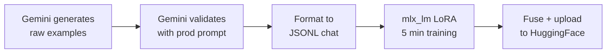
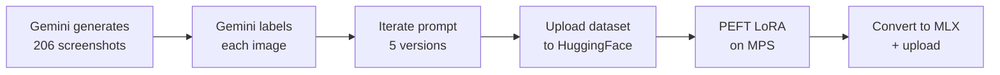
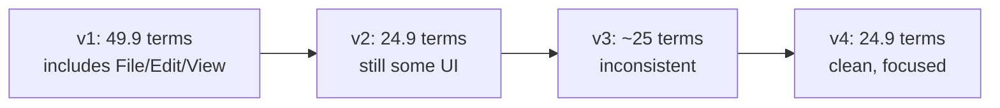

# Fine-Tuning Qwen3.5 on Apple Silicon: Text & Vision

## The Problem

Fine-tuning usually means renting cloud GPUs, fighting CUDA drivers, and watching your credit card. Apple Silicon changes this — your Mac's RAM _is_ your VRAM. No data transfers, no OOM surprises. With [MLX](https://github.com/ml-explore/mlx), LoRA fine-tuning takes minutes, on your laptop, for free.

## What This Guide Covers

We fine-tuned [Qwen3.5-0.8B](https://huggingface.co/Qwen/Qwen3.5-0.8B) for two tasks inside [keysay](https://github.com/kikoncuo/keysay), a macOS dictation app:

**Text correction** — Clean messy ASR output. The base model scores 0/12. After 5 min of LoRA: 12/12.

**Screen context extraction** — Read screenshots, extract terms that help ASR. 206 synthetic images, 5 prompt iterations, two training frameworks compared.

## Results at a Glance

```
Base model:   "es a las 5, no perdón, a las 6"  →  echoes input unchanged
Fine-tuned:   "es a las 5, no perdón, a las 6"  →  "es a las 6"
```

| | Base | Fine-tuned | Gemini Flash (teacher) |
|---|---|---|---|
| Accuracy | 0/12 | **12/12** | 11/12 |
| Cost | - | $0 | API fees |
| Training | - | 5 min | - |
| RAM | 3 GB | 3.6 GB | - |
| Speed | ~300 tok/s | ~300 tok/s | ~50 tok/s |

The student outperforms its teacher. Knowledge distillation with teacher validation creates a consistent decision boundary the teacher itself doesn't maintain.

---

## Requirements

```bash
pip install mlx_lm mlx-vlm>=0.4.0           # MLX training + inference
pip install torch torchvision peft accelerate # PEFT training (Part 2)
pip install python-dotenv requests datasets   # Data generation
export OPENROUTER_KEY="sk-or-v1-..."          # For Gemini API calls
```

Apple Silicon Mac, 16+ GB RAM. Training peaks at 3-4 GB.

---

## Part 1: Text Correction

### The Task

```
"es a las 5, no perdón, a las 6 de la tarde"     →  "es a las 6 de la tarde"
"I think we should um go with the uh first option" →  "I think we should go with the first option"
"the budget is 100, no wait, 200, actually 150k"   →  "the budget is 150k"
```

Remove self-corrections, fillers, false starts. Keep everything else. The base 0.8B model can't do this — it echoes input or loops. Bigger models work but are too heavy for real-time dictation.

### Pipeline



### Data Generation

Two-step knowledge distillation using Gemini Flash:

**Generate** — Gemini creates input/output pairs across 5 categories:

| Category | Examples | Description |
|---|---|---|
| Filler removal | ~40 | Spanish & English fillers |
| Cross-sentence | ~40 | "X. No, Y" corrections |
| Nested | ~40 | Multiple corrections chained |
| Realistic long | ~40 | 3-5 sentence messages |
| Edge cases | ~40 | "no" as a word, passthrough |

**Validate** — Every example re-processed through Gemini with the _production system prompt_. Teacher output replaces the generated output:

```python
# The key insight: validate with the EXACT prompt used at inference
def validate_example(example, api_key):
    payload = {
        "model": "google/gemini-3-flash-preview",
        "messages": [
            {"role": "system", "content": SYSTEM_PROMPT},  # Same prompt as prod
            {"role": "user", "content": example["input"]},
        ],
        "temperature": 0.3,
    }
    return {"input": example["input"], "output": teacher_output}
```

This eliminates distribution mismatch between training and inference. ~70% Spanish, ~30% English.

```bash
python3 scripts/generate_training_data.py --count 200 --output training_data_v2.json
```

### Dataset Format

```python
# Each example → chat conversation in JSONL
{"messages": [
    {"role": "system", "content": "You clean speech-to-text transcriptions..."},
    {"role": "user", "content": "es a las 5, no perdón, a las 6"},
    {"role": "assistant", "content": "es a las 6"}
]}
```

```bash
python3 scripts/format_dataset.py --input training_data_v2.json --output dataset_v2/
# → train: 306 | valid: 28 | test: 26
```

### Training

```bash
python3 -m mlx_lm.lora \
    --model mlx-community/Qwen3.5-0.8B-8bit \
    --data dataset_v2 \
    --train \
    --iters 1000 \
    --batch-size 2 \
    --learning-rate 3e-5 \
    --lora-rank 8 \
    --steps-per-eval 200 \
    --adapter-path transcription-cleaner-lora
```

**Loss curve:**

```
Iter    1 → Val loss 1.727
Iter  200 → Val loss 0.136  ← converges fast
Iter  400 → Val loss 0.176
Iter 1000 → Val loss 0.159

Train loss: 1.727 → 0.005 | 5 min | 3.6 GB peak
```

The model converges in ~200 iters. This is a narrow, well-defined task.

### Evaluation

| Test Case | Base | Fine-tuned | Teacher |
|---|---|---|---|
| Simple correction (ES/EN) | Echoes | **Pass** | Pass |
| Cross-sentence correction | Fail | **Pass** | Pass |
| Nested corrections | Fail | **Pass** | Close |
| Double correction chain | Fail | **Pass** | **Fail** |
| Passthrough (no correction) | Partial | **Pass** | Pass |
| Filler removal (ES/EN) | Fail | **Pass** | Pass |
| False negative ("no" as word) | Fail | **Pass** | Pass |
| **Total** | **0/12** | **12/12** | **11/12** |

The 12 test cases were **hand-written and never seen during training** — they're not in the generated dataset. The fine-tuned model beats its teacher on double corrections because consistent training data creates a cleaner decision boundary than the teacher has.

### Deploy

```bash
# Fuse adapter into base model
python3 -m mlx_lm.fuse \
    --model mlx-community/Qwen3.5-0.8B-8bit \
    --adapter-path transcription-cleaner-lora \
    --save-path keysay-transcription-cleaner-0.8B-8bit

# Upload
huggingface-cli upload Enriqueag26/keysay-transcription-cleaner-0.8B-8bit \
    keysay-transcription-cleaner-0.8B-8bit
```

**Inference:**

```python
from mlx_lm import load, generate

model, tokenizer = load("Enriqueag26/keysay-transcription-cleaner-0.8B-8bit")

messages = [
    {"role": "system", "content": "You clean speech-to-text transcriptions..."},
    {"role": "user", "content": "es a las 5, no perdón, a las 6"},
]
prompt = tokenizer.apply_chat_template(
    messages, tokenize=False, add_generation_prompt=True,
    enable_thinking=False,  # Important for Qwen3.5
)
result = generate(model, tokenizer, prompt=prompt, max_tokens=1024)
# → "es a las 6"
```

~300 tok/s, ~3 GB RAM on Apple Silicon.

---

## Part 2: Screen Context Extraction

### The Task

The user dictates while looking at their screen. A screenshot provides context hints — proper nouns, jargon, product names — that help ASR recognize words like "Kubernetes" or "Dr. Martinez".

```
Screenshot of Slack chat about PostgreSQL migration
    → "Sarah Chen, PostgreSQL 16, pg_dump, pg_restore, David Kim, EKS, Helm"
```

### Pipeline



### Image Generation

Synthetic macOS screenshots via **Gemini 3.1 Flash image preview**, 7 categories:

| Category | Count | Examples |
|---|---|---|
| Corporate email | 30 | Gmail/Outlook — medical, legal, finance |
| Chat apps | 30 | Slack/WhatsApp/Teams — projects, jargon |
| Code editors | 30 | VS Code/Xcode — functions, imports |
| Documents | 30 | Docs/Word/PDF — reports, contracts |
| Browsers | 29 | Chrome/Safari — docs, dashboards |
| Spreadsheets | 30 | Excel/Sheets — financial, metrics |
| Mixed | 27 | Terminal, Finder, Calendar |

6 parallel workers, 21 images/min, 206/210 successful, ~10 min total.

**OpenRouter image extraction gotcha** — images come in `msg["images"]`, not `msg["content"]`:

```python
message = result["choices"][0]["message"]
images = message.get("images", [])  # Not in "content"!
url = images[0]["image_url"]["url"]  # "data:image/png;base64,..."
```

### Prompt Engineering

The labeling prompt went through 5 iterations. The problem: Gemini dumps everything including menus.



**Before (v1):** `File, Edit, Selection, View, Go, Run, Terminal, Window, Help, data_analysis_workflow, EXPLORER, import numpy...` (90 terms for a code editor)

**After (v4):** `SQLAlchemy, ORM, User, Column, ForeignKey, relationship, Post, backref` (27 terms)

| Category | v1 | v4 | Change |
|---|---|---|---|
| spreadsheets | 66.9 | 26.7 | **-60%** |
| corporate_email | 43.9 | 18.7 | **-57%** |
| code_editors | 61.6 | 32.1 | **-48%** |
| **Overall** | **49.9** | **24.9** | **-50%** |

The v4 prompt:

```
You are extracting speech recognition context hints from a screenshot.
EXTRACT ONLY: people names, company/brand names, product names,
project names, email addresses, URLs, technical jargon, acronyms, proper nouns.
EXCLUDE: application menus (File, Edit, View), generic UI labels,
window controls, common words, dates, numbers.
SKIP blurry or garbled text.
Comma-separated list only.
```

### Baseline

Base model + v4 prompt, no fine-tuning:

```
Overall:  P=0.677  R=0.366  F1=0.411

Best:     corporate_email  F1=0.475
Worst:    code_editors     F1=0.321 (low recall)
```

High precision, low recall — the model extracts correct terms but misses many.

### Training: mlx-vlm vs PEFT

We tried two frameworks. One broke, one worked.

#### mlx-vlm LoRA (failed)

Three attempts, three failures. All adapters corrupted generation — model outputs only vision tokens:

```
Expected: "Sarah Chen, PostgreSQL 16, pg_dump..."
Got:      "<|vision_start|><|image_pad|><|vision_end|>"
```

| Attempt | lr | rank | Result |
|---|---|---|---|
| v1 | 1e-5 | 8 | Vision tokens only |
| v2 | 5e-6 | 4 | Vision tokens only |
| v3 | 1e-5 | 8 (4096 seq) | Vision tokens only |

Likely a bug with Qwen3.5's DeltaRNN/linear attention in mlx-vlm v0.4.0.

#### transformers + PEFT on MPS (working)

Switched to PyTorch with Metal Performance Shaders:

```python
from peft import LoraConfig, get_peft_model, TaskType

model = AutoModelForImageTextToText.from_pretrained(
    "Qwen/Qwen3.5-0.8B",
    torch_dtype=torch.float32,  # MPS requires float32
)

lora_config = LoraConfig(
    r=8, lora_alpha=16, lora_dropout=0.05,
    target_modules=["q_proj", "k_proj", "v_proj", "o_proj",
                    "gate_proj", "up_proj", "down_proj"],
    task_type=TaskType.CAUSAL_LM,
)
model = get_peft_model(model, lora_config)
# trainable: 3.2M / 856M = 0.37%
```

**MPS-specific settings:**

```python
TrainingArguments(
    fp16=False, bf16=False,       # MPS doesn't support bf16
    dataloader_pin_memory=False,  # Required for MPS
    per_device_train_batch_size=1,
    gradient_accumulation_steps=4,
    learning_rate=2e-5,
    lr_scheduler_type="cosine",
    num_train_epochs=3,
)
```

~60s/step, ~2 hours for 156 steps.

**Label masking** — only train on the assistant response:

```python
# Find <|im_start|>assistant and mask everything before it
labels[i, :assistant_start] = -100
```

### Convert to MLX

```python
# Merge adapter
merged = model.merge_and_unload()
merged.save_pretrained("vlm_training/peft-fused")
```

```bash
# Convert + quantize
python3 -m mlx_vlm.convert \
    --hf-path vlm_training/peft-fused \
    --mlx-path keysay-vlm-context-0.8B-8bit -q 8

# Upload
huggingface-cli upload Enriqueag26/keysay-vlm-context-0.8B-8bit \
    keysay-vlm-context-0.8B-8bit
```

---

## Lessons Learned

### What worked

**Knowledge distillation** — Gemini generates + validates data. Student outperforms teacher on edge cases. Consistent training data > smarter teacher.

**mlx_lm for text LoRA** — 5 min training, 3.6 GB peak, 300 tok/s inference. Hard to beat for text-only fine-tuning on Mac.

**Parallel data generation** — 6 workers, 21 img/min vs 5/min sequential. Always parallelize API calls.

**Prompt engineering first** — 5 rounds of prompt refinement: F1 0.350 → 0.411. Bigger gain than any model change.

### What didn't work

**mlx-vlm LoRA on Qwen3.5** — All attempts corrupted generation. Bug in mlx-vlm v0.4.0 with DeltaRNN architecture.

**Small max-seq-length for VLM** — 512 tokens gets consumed by image tokens. Only 23 answer tokens trained per step. Model learns nothing.

### Takeaways

- **Start with the prompt.** Our prompt improvement alone was worth +17% F1.
- **Teacher validation > raw generation.** Same prompt at training and inference = no distribution mismatch.
- **Small models beat large ones on narrow tasks.** 0.8B gets 12/12 where Gemini gets 11/12.
- **When one framework fails, try another.** mlx-vlm broke; PEFT on MPS worked.
- **Sanity-check adapter output immediately.** Would have saved hours of broken evals.

---

## Models & Datasets

| Resource | Link |
|---|---|
| Fine-tuned text model | [`Enriqueag26/keysay-transcription-cleaner-0.8B-8bit`](https://huggingface.co/Enriqueag26/keysay-transcription-cleaner-0.8B-8bit) |
| VLM context model | [`Enriqueag26/keysay-vlm-context-0.8B-8bit`](https://huggingface.co/Enriqueag26/keysay-vlm-context-0.8B-8bit) (pending) |
| VLM training dataset | [`Enriqueag26/keysay-vlm-context-training`](https://huggingface.co/datasets/Enriqueag26/keysay-vlm-context-training) |
| Base model | [`Qwen/Qwen3.5-0.8B`](https://huggingface.co/Qwen/Qwen3.5-0.8B) |
| Base model (MLX 8-bit) | [`mlx-community/Qwen3.5-0.8B-8bit`](https://huggingface.co/mlx-community/Qwen3.5-0.8B-8bit) |

---

## License

MIT. Qwen3.5 is [Apache 2.0](https://huggingface.co/Qwen/Qwen3.5-0.8B/blob/main/LICENSE).
